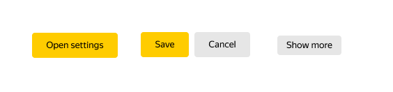

# shri-2020-home-task-01

### Использованные инструменты

- **Webpack** - для сборки итогового css бандла
- **Sass** - для удобства написания кода по БЭМ-методологии

### Файловая структура
Html страницы и собранный css-бандл лежат в папке `build`.

Все блоки описаны в отдельных файлах `.scss`, расположенных в `src/styles/blocks/`. Имена файлов совпадают с именами блоков.

## Ответы на вопросы
### правильное использование БЭМ-сущностей
- какие части макета являются одним и тем же блоком?
1) Кнопки на стартовой странице `index.html`, странице `settings.html` и `build-history.html`.

2) Header и footer на каждой странице являются одним и тем-же блоком
3) Карточки с описанием коммита на станицах `build-history.html` и `build-details.html`.
4) Блоки `text` с различными модификаторами встречаются во многих местах на каждой странице.

- какие стили относятся к блокам, а какие к элементам и модификаторам?
Согласно БЭМ методологии, **блок** - это функционально независимый компонент страницы, который может быть переиспользован, **элемент** - составная часть блока, которая не может быть использована в отрыве от него, **модификатор** - сущность, определяющая внешний вид, состояние или поведение блока либо элемента.

Выбирая, что сделать блоком, а что элементом, я исходил из того, используется ли данная сущность где-то ещё, в отрыве от родительского блока. Если да, то я создавал новый блок, если нет, то элемент. 

- где нужно использовать каскады и почему?
Я постарался свести использование каскадов к минимуму, поскольку они усложняют код и могут затруднять его дальнейшее сопровождение. На мой взгляд их стоит использовать, только если требуется реализовать какое-то сложное поведение для определенной сущности в единственном месте. В таком случае проще использовать каскад, чем создавать дополнительные модификаторы или элементы. 

В данной работе я использовал каскадирование, чтобы сделать всплывающую при наборе текста в инпуте иконку очистки. Идея была в том, что когда в инпуте пропадает плейсхолдер, иконка переходит из состояния `display: none` в `display: block`. Это всё происходит в блоке `form-group`.

### консистентность
- какие видите базовые и семантические константы?

- какие видите закономерности в интерфейсе?

### адаптивность
- где видите вариативность данных и как это обрабатываете?

- какие видите особенности, связанные с размером экрана?

- что еще повлияло на вашу вёрстку?

## TODO
- троеточие
- отображение на широкоформатных экранах
- сделать константы для отступов
